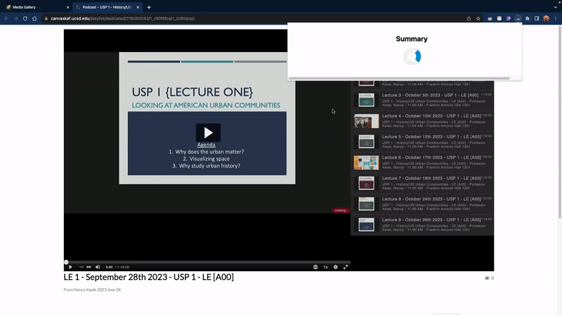

## Canvas Summarizer

Chrome Extension for Canvas LMS lecture summaries for UC San Diego students.

## Project Status

This project is currently under review in [Google Web Store](https://chrome.google.com/webstore/category/extensions). 

## Project Screen Shot(s)

 

## Reflection

Throughout 2023 I have been using ChatGPT, Anthopic's Claude and other GPT based tools for my classes. I would summarize lectures, readings, and use these tools to prepare for exams. I found myself copy-pasting a lot of the same files and thought it would be useful to automate this process.

Originally I wanted to use [Canvas Instructure API](https://canvas.instructure.com/doc/api/) which has access to all the resources within our school's platform. After digging around and writing a few scripts I realized that due to our university's strict data access policy I don't have the permission to use the API :( Bummer... but what can you do... 

I thought I would have to bury this project in my backyard, but after talking to my friends and professors I realized that I could make a Chrome extension that scrapes the Canvas LMS page instead of using the API. I wrote a few scripts based on the DOM structure of the Canvas Page (~~please don't patch it~~) and connected the lecture captions to Cohere's [Summarizer](https://cohere.com/slo) via their API. 

I published the Chrome extension explaining the use case and the privacy policy, so once it's approved, I hope to get some user feedback and add some new features. 